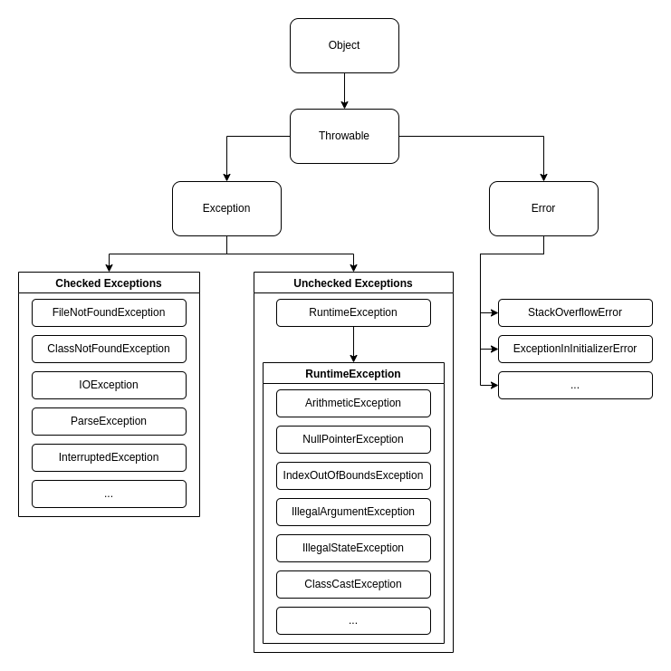

# Throwable in Java

## Description
This repository is a workshop on `Throwable` in Java, mainly on `Exceptions` subclass. It presents the key points regarding that issue and relevant usage cases.

## Types
Below are listed some of the most common types of `Throwable` in Java. Their usage examples are provided in the `eu.ciechanowiec.exceptions.throwableproducer` package.

### Exceptions
* ClassNotFoundException
* IOException
* ParseException
* InterruptedException
* RuntimeException:
  * ArithmeticException
  * NullPointerException
  * IndexOutOfBoundsException
  * IllegalArgumentException
  * IllegalStateException
  * ClassCastException

### Errors
* StackOverFlowError

### Mnemonics
Checked exceptions: C **io** P **i** 
Unchecked exceptions: **A** n i i **C**

## Throwable tree

## Key words 
* `throwing`
* `try`
* `catch`
* `finally`
* `throw new`

## Key points
* `System.exit(...)` 
If system `System.exit(...)` command inside `try` block is executed, the program immediately stops. Even `finally` block is not executed. 
See `eu.ciechanowiec.exceptions.systemexit` package.
* `finally` 
The `finally` block always executes when the `try` block exits. This ensures that the `finally` block is executed even if an unexpected exception occurs.
* Multicatching with `catch (Exception1 | Exception2 e)`
* 
